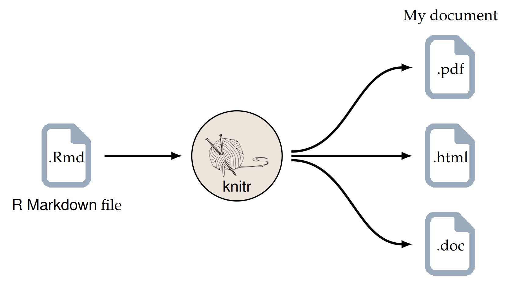

# Header 1

This is an example text. Let us make a list now.

-   Item 1
-   Item 2
    -   Item A
    -   Item B
    -   Item C
-   Item 3

## Header 2

Let us make an numbered list

1.  Item 1
2.  Item 2
3.  Item 3
4.  Item 4

### Header 3

This is an *italics* text.

This is **bold** text

1.  This is both ***italics and bold***

This is $\underline{underline}$ text

# How to add a figure

{width="693"}

This is an article I have written in PlosOne.[@mitra2020po]

This is the second citation.[@2012n]

I am going to add a reference.[@2015i; @2019; @2020ec; @2020ods-ynsfaml&m]

# How to add a table

| Sno | Name          | Gender |
|-----|:---------------:|--------|
| 1   | Arun          | Male   |
| 2   | Adrija        | Female |
| 3   | Nagabhushanam | Male   |

: This is my table


# How to add code chunks

```{r include=FALSE}
library(tidyverse)
library(gtsummary)

df <- MASS::birthwt

df %>% names()
```

# Prepare a plot

```{r echo=FALSE, fig.cap="This is the histogram of maternal age", warning=FALSE, message=FALSE}
# hist(df$age)

df %>% 
  ggplot() +
  geom_histogram(aes(x = age)) +
  labs(x =  "Age in Years", title = "Histogram of Age from the Birthweight Data set from MASS Package", y = "Frequency")
```


```{r message=FALSE, echo=FALSE}
df %>% 
  select(low, bwt, age) %>% 
  tbl_summary()
```


# References
