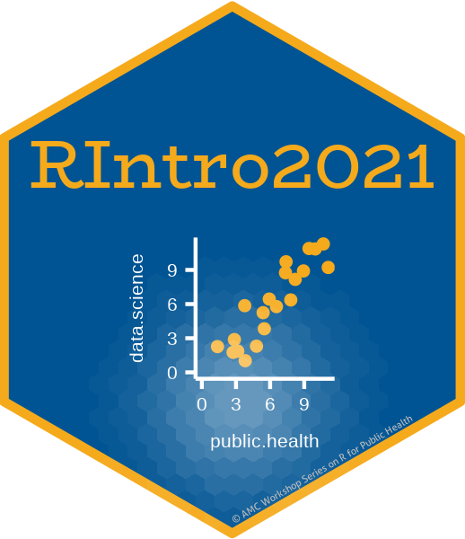
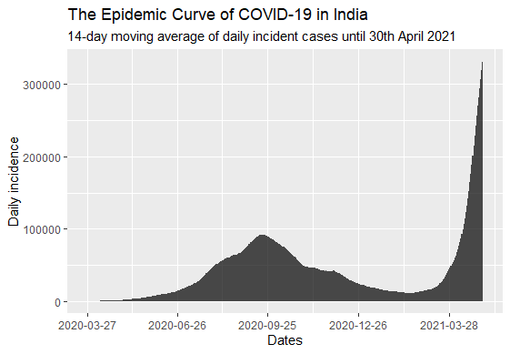
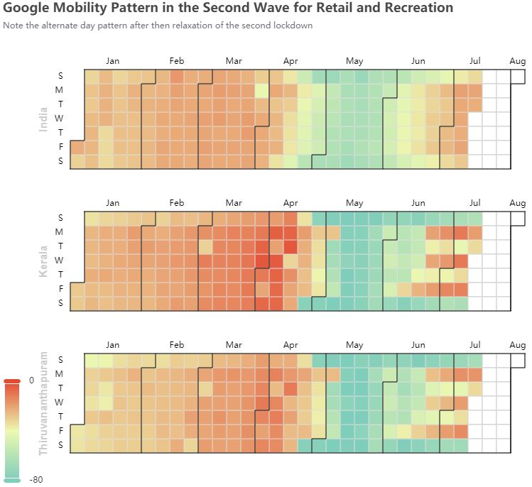

------------------------------------------------------------------------

# Header 1

## Header 2

### Header 3

#### Header 4

##### Header 5

###### Header 6

------------------------------------------------------------------------

# List Elements

-   item 1
-   item 2
-   item 3

------------------------------------------------------------------------

-   item 1

    -   item A

        -   item B

    -   item C

-   item 2

    -   item D
    -   item E
    -   item F

-   item 3

    -   item G
    -   item H

------------------------------------------------------------------------

# Header

#Header

------------------------------------------------------------------------

This is a enumerated list

1.  item 1
2.  item 2
3.  item 3
4.  item 4
5.  item 5

This is a line break

1.  **item 1**
2.  *item 2*
3.  **item 3**
4.  *item 4*
5.  item 5




# Including Plots with R Chunks

Let us prepare a plot using the `birthwt` dataset from the `MASS` package.

### Lets load data

Let us assume we have already installed the package `MASS`.

```{r}
library(tidyverse)
library(ggplot2)
library(gtsummary)
# library(MASS)

df <- MASS::birthwt

```

## About the dataset

The birthwt data frame has 189 rows and 10 columns. The data were collected at Baystate Medical Center, Springfield, Mass during 1986.

## Let us look at the labels of the data

```{r}
library(labelled)

labelled::look_for(df)

df <- df %>% 
  set_variable_labels(low = "Low Birth Weight (< 2.5 Kgs)") %>% 
  set_variable_labels(smoke = "Smoking Status") %>% 
  set_variable_labels(race = "Mothers Race") %>% 
  set_value_labels(race = c("White" = 1, "Black" = 2,  "Other" = 3))


```

# Summary Table

```{r}
df %>% dplyr::select(race, smoke, low) %>%
  mutate(race = ifelse(race == 1, "White",
                ifelse(race == 2, "Black", "Others"))) %>% 
  mutate(race = factor(race, levels = c("White", "Black", "Others"))) %>% 
  tbl_summary(by = race) %>% 
  add_p()

```

# Saving your cleaned data as an `.rds` file

```{r}
write_rds(df,"saved_data.rds")
write_csv(df, "saved_csv.csv")

```

# Using the Visual Editor

### Adding Tables into you RMD

### This I want as a third level header

*This text as italics*

[***This text as bold***]{.ul}

```{r}

2+2 

4+4 

```

| Name | Gender | Place |
|------|--------|-------|
| Arun | Male   | TRV   |
| XYZ  | Female | XYZ   |

: This is a caption

### Adding Figures into you RMD

{width="438"}


