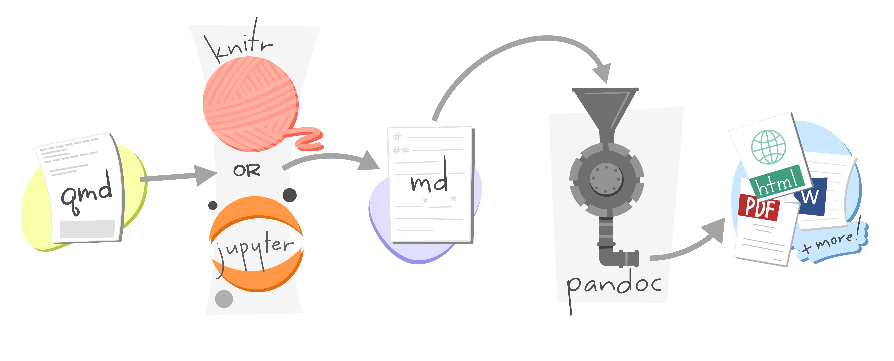

```{r setup, include=FALSE}
options(htmltools.dir.version = FALSE)
```


class: center middle

.center[]


---


.top[# What is Quarto?]

.middle[
### Quarto is a file format for making dynamic documents with R. 


### A Quarto document is written in markdown (an easy-to-write plain text format) and contains chunks of embedded R code


### Quarto provides an unified authoring framework for data science, combining your code, its results, and your prose commentary. 


### Quarto documents are fully reproducible and support dozens of output formats, like PDFs, Word files, slideshows, and more.

]

---
class: middle

.top[# What is Quarto?]

.center[]

---

# Need some help?

- Download Quarto: *https://quarto.org/docs/get-started/*

- Quarto Guide: *https://quarto.org/docs/guide/*

- Markdown Reference Sheet: *Help > Markdown Quick Reference*
 


You'll need the Quarto Command Line Interface but it is automatically done by RStudio for you.

To create a new Quarto document (`.qmd`), select *File -> New File -> Quarto Document* in RStudio, then choose the file type you want to create. For now we will focus on a `.html` Document, which can be easily converted to other file types later.

It contains three important types of content:

- An (optional) YAML header surrounded by `---`
- Chunks of R code surrounded by ` ``` `
- Text mixed with formatting like `##` headings and simple text.

---

class: middle

.top[# Components of a Quarto Document]

.center[]


---

# YAML Header

### Defines the metadata

### Defines the output format

### Defines options of the output format


```
---
title: "First Example"
author: "Arun Mitra"
date: today
output: html
toc : true
---

```

---
class: middle

.top[# Markdown is Cool]

.center[]

---

class: middle

.top[# Basic Markdown Syntax]

.center[]


---
class: middle

# Code Chunks 

The knitr package extends the basic markdown syntax to include chunks of executable R code.

When you render the report, knitr will run the code and add the results to the output file. You can have the output display just the code, just the results, or both.

To embed a chunk of R code into your report, surround the code with two lines that each contain three back ticks. After the first set of back ticks, include ` ```{` `r` `}`, which alerts knitr that you have included a chunk of R code. 
---
class: middle

.top[# R Chunks]

.center[]


---
class:middle

# Chunk Options

### To omit the results

To omit the results from your final report (and not run the code) add the argument `eval = FALSE` inside the brackets and after `r`. This will place a copy of your code into the report.


### To omit the code

To omit the code from the final report (while including the results) add the argument `echo = FALSE`. This is very handy for adding plots to a report, since you usually do not want to see the code that generates the plot.
---

class: middle

.top[# R Chunks]

.center[]


---

class: middle

.top[# R Chunks]

.center[]


---


# Inline R Code

You can also evaluate R expressions inline by enclosing the expression within a single back-tick qualified with `r`. 


`knitr` will replace the inline code with its result in your final document (inline code is always replaced by its result). The result will appear as if it were part of the original text.


.center[]


---

class: middle

.top[# How Does Quarto Work?]

.center[]


---

# Conclusion


### Quarto is awesome. 

- The ratio of markup to content is excellent. 

- For exploratory analyses, blog posts, and interactive documents

- For journal articles, though knowledge on $\LaTeX$ / CSS / HTML will  be helpful.

### The RStudio team have made the whole process very user friendly.

- RStudio provides useful shortcut keys for compiling to HTML, and running code chunks. 

- These shortcut keys are presented in a clear way.

- Code completion on R code chunk options is really helpful. 
    

---


class: center middle

.center[]
---

class: middle center

# Questions?