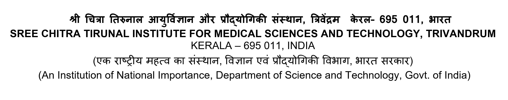

This is an [RMarkdown]{.underline} Document.[@mitra2022jhef]

# This is a first level header

Sample Text

## Header 2

Sample Text

### Header 3

Sample Text

# This is another first level header

## Creating Lists in RMarkdown

-   List 1

-   List 2

    -   Item a
    -   Item b

-   List 3

### Bold and italics

This is **bold** text. This is *italics* text.

\newpage

## Adding a table

| Col1   | Col2 | Col3   |
|--------|------|--------|
| Arun   | 123  | samosa |
| Antony | 345  | burger |
| Nesan  | 456  | pakoda |

```{r message=FALSE, warning=FALSE}
library(tidyverse)
library(gtsummary)

df <- MASS::birthwt

df %>% 
  select(lwt, low) %>% 
  tbl_summary(by = low)


```

### Using `dplyr` verbs

```{r}
df %>% 
  group_by(low) %>% 
  summarize(mean = mean(lwt))

```

## Adding Images to your RMarkdown Document




```{r}
df %>% 
  ggplot() +
  geom_bar(aes(x = factor(low)))
```

# Adding Citation in RMarkdown

This is my text. I want to add a reference here.[@mitra2020po]

# References
